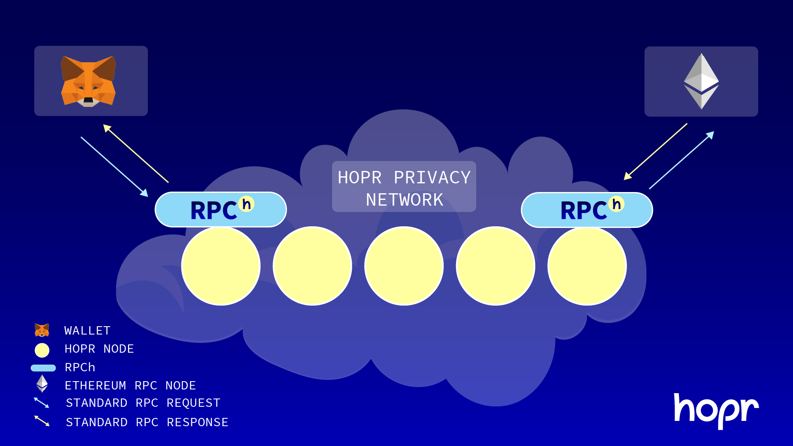

# Guide

Welcome to HOPR's wallet integration guide.
In this guide, we will be making sure you have everything you need to begin integrating your favourite wallet with HOPR.

<!-- Additionally, there is a supplementary [demo](./demo) which might help assist you in your journey. -->

## Getting Started

[HOPR](https://hoprnet.org/) is a privacy-preserving messaging protocol which enables the creation of a secure communication network via incentivized relay nodes. You run HOPR by using [HOPRd](https://docs.hoprnet.org/v1.85/core/what-is-hopr) (HOPR Daemon).

[RPCh](https://github.com/hoprnet/rpch) is an application you can run alongside your HOPRd node, which will send all your RPC requests through HOPR, preserving your privacy.

### How it works

[RPCh](https://github.com/hoprnet/rpch) acts as a translation layer between the wallet and a HOPRd node.
All RPC requests made by the wallet must be sent to RPCh. Once received, RPCh will send these messages through the HOPR network and await a response to return.

For this guide, we have created an easy-to-use docker-compose file which can be used to create the environment required (5 HOPRd nodes, 5 RPCh) so you don't need to shuffle through all our docs and set up the environment manually.

### Setting up a working environment

In the following setup, we are creating a local environment, making 5 HOPRd nodes and 5 RPChs available. For every HOPRd node, we have one RPCh, as we want every HOPRd node to be capable of processing RPC requests. Five HOPRd nodes are enough to emulate a working HOPR network, allowing us to run everything locally.

#### Requirements

- make
- docker
- docker-compose

#### Steps

1. Go to [RPCh repository](https://github.com/hoprnet/rpch)
2. Clone the project locally
3. Run `RELAY_VERSION=v0.0.1 make devkit-run`

Once you've completed the steps, you will have a local HOPR and HOPR Relay cluster running, ready to accept RPC requests!

Three important endpoints become available locally:

1. `http://localhost:9001` used later on to send requests to RPCh. Use `http://localhost:9001/?exit-provider=https://primary.gnosis-chain.rpc.hoprtech.net` to send requests to Gnosis chain via HOPR
2. `http://localhost:13301` HOPRd's API endpoint, check out `http://localhost:13301/api/v2/_swagger`
3. `http://localhost:19501` HOPRd's admin panel, use `http://localhost:19501/?apiEndpoint=http://localhost:13301&apiToken=^^awesomeHOPRr3l4y^^` for access

#### Connecting a wallet

RPCh is designed to be a drop-in replacement to your usual provider (ex: infura).
This means that within the wallet, the only change that needs to be made is:

1. Switching the provider URL to one of your locally running RPChs
   Example: `https://primary.gnosis-chain.rpc.hoprtech.net` to `http://localhost:9001/?exit-provider=https://primary.gnosis-chain.rpc.hoprtech.net`

As you can see from the example above, the only difference is that you need to specify the _exiting_ provider (used to process requests) within the URL parameters.

### List of wallets

- [AmbireTech](https://github.com/AmbireTech/wallet)
- [BlockWallet](https://github.com/block-wallet/extension)
- [enKrypt](https://github.com/enkryptcom/enKrypt)
- [Frame](https://github.com/floating/frame)
- [MetaMask](https://github.com/MetaMask/metamask-extension/)

### Implementation ideas

1. Most importantly, it is not ideal to ask users to update their existing URLs, such as `<rpch>/?exit-provider=<exit-provider>`. Your job is to find creative ways to make this as user-friendly as possible.
   Possible options:
   - Add an input field per network
   - Add an input field in the settings and a checkbox for every network that enables HOPR.
2. While RPCh uses a restful API endpoint, you can use HOPRd's API endpoint `http://localhost:13301/api/v2/_swagger` to fetch various data that can be complementary to the wallet integration. For example, API `http://localhost:13301/api/v2/account/balances` will show you the balance available for the running HOPRd node, which the user might find helpful.

### Assets

You can find access to various HOPR assets such as logos and colour values [here](https://drive.google.com/drive/folders/1SavIZB-ALgXZ3RBvt27l2HRvIHk6q4kB?usp=sharing).
