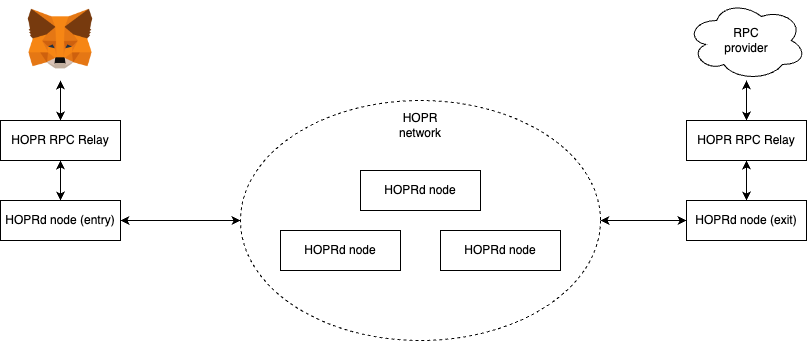

# Guide

Welcome to HOPR's wallet integration guide.
In this guide, we will be making sure you have everything you need to begin integrating your favorite wallet and HOPR.

<!-- Additionally, there is a supplementary [demo](./demo) which might help assist you in your journey. -->

## Getting Started

[HOPR](https://hoprnet.org/) is a privacy-preserving messaging protocol which enables the creation of a secure communication network via relay nodes powered by economic incentives using digital tokens.
You run HOPR by using [HOPRd](https://docs.hoprnet.org/v1.85/core/what-is-hopr) (HOPR Daemon).

[HOPR RPC Relay](https://github.com/hoprnet/hopr-rpc-relay) is an application you can run alongside your HOPRd node which will send all your RPC requests through HOPR, preserving your privacy.

### How it works

["HOPR RPC Relay"](https://github.com/hoprnet/hopr-rpc-relay) is a translation layer between HOPR nodes and wallets/RPC providers. Different from a ubiquitous approach where wallets send RPC requests directly to an RPC provider, all the RPC requests made by a wallet are sent to HOPR network via a "HOPR RPC Relay". RPC requests in HOPR network gets mixed and reconstructed by the "HOPR RPC Relay" before reaching a RPC provider. The "HOPR RPC Relay" on the wallet side awaits a response to the request to return.

For this guide, we have created an easy to use docker-compose file which can be used to create the environment requires (5 HOPRd nodes, 5 HOPR RPC Relay) so you don't need to shuffle through all our docs and setup the environment manually.

### Setting up a working environment

In the following setup, we are creating a local environment where we are making 5 HOPRd nodes and 5 HOPR RPC Relays available. For every HOPRd node we have one HOPR RPC Relay, as we want every HOPRd node to have the capability of processing RPC requests.
Five HOPRd nodes are enough to emulate a working HOPR network, allowing us to run everything locally.

#### Requirements

- make
- docker
- docker-compose

#### Steps

1. Go to [HOPR RPC Relay repository](https://github.com/hoprnet/hopr-rpc-relay)
2. Clone the project locally
3. Run `RELAY_VERSION=v0.0.1 make devkit-run`

Once steps are completed, you will have a local HOPR and HOPR Relay cluster running, ready to accept RPC requests!

Three important endpoints become available locally:

1. `http://localhost:9001` used later on to send requests to HOPR RPC Relay, use `http://localhost:9001/?exit-provider=https://primary.gnosis-chain.rpc.hoprtech.net` to send requests to Gnosis chain via HOPR
2. `http://localhost:13301` HOPRd's API endpoint, checkout `http://localhost:13301/api/v2/_swagger`
3. `http://localhost:19501` HOPRd's admin panel, use `http://localhost:19501/?apiEndpoint=http://localhost:13301&apiToken=^^awesomeHOPRr3l4y^^` to access

#### Connecting a wallet

HOPR RPC Relay was designed to be a drop-in replacement from your usual provider (ex: infura).
This means that within the wallet, the only changes that need to be done are:

1. Switch provider URL to one of your locally running HOPR RPC Relays
   Example: `https://primary.gnosis-chain.rpc.hoprtech.net` to `http://localhost:9001/?exit-provider=https://primary.gnosis-chain.rpc.hoprtech.net`
2. As you can see from the example above, the only difference is that you need to specify within the URL parameters the _exiting_ provider, which the requests will eventually be processed.

### List of wallets

- [AmbireTech](https://github.com/AmbireTech/wallet)
- [BlockWallet](https://github.com/block-wallet/extension)
- [enKrypt](https://github.com/enkryptcom/enKrypt)
- [Frame](https://github.com/floating/frame)
- [MetaMask](https://github.com/MetaMask/metamask-extension/)

### Implementation ideas

1. Most importantly, is not ideal to ask users to update their existing URL such as `<hopr-rpc-relay>/?exit-provider=<exit-provider>` to finding creative ways on how to make this as user-friendly as possible is important.
   Possible options:
   - Add an input field per network
   - Add an input field in the settings, and a checkbox for every network to that enables HOPR.
2. While HOPR RPC Relay offers on restful API endpoint, you can use HOPRd's API endpoint `http://localhost:13301/api/v2/_swagger` to fetch various data can be complimentary to the wallet integration.
   For example, using API `http://localhost:13301/api/v2/account/balances` will show you the balance available for the running HOPRd node, which is useful to know.

### Assets

You can find access to various HOPR assets such as logos and color values [here](https://drive.google.com/drive/folders/1SavIZB-ALgXZ3RBvt27l2HRvIHk6q4kB?usp=sharing).
